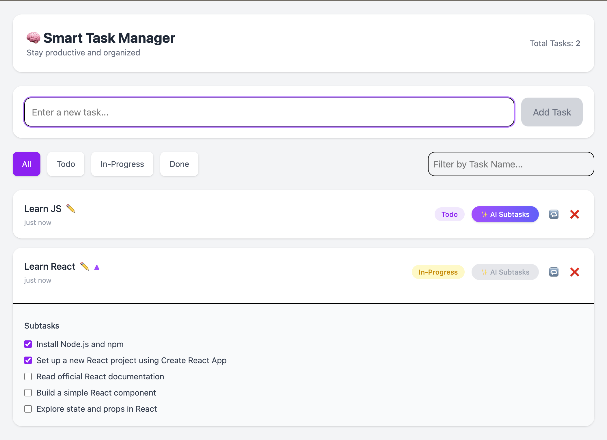

<div>

# AI Smart Manager 🤖✅

**A lightweight task manager with an AI-powered assistant to help you plan, prioritize, and stay on track.**

[](#-tech-stack)
[](#-tech-stack)
[](#-tech-stack)
[](#-license)

</div>

---

## Screenshot



## 🌐 **Live Demo:** https://ai-smart-manager.vercel.app/

---

## ✨ Highlights

- **🧠 AI assistance**: generate suggestions for tasks, prioritization, and planning help.
- **🗂️ Task management**: create, update, organize, and track tasks.
- **⚡ Fast local dev**: React frontend + FastAPI backend.
- **🧩 Clean architecture**: separate frontend (`/src`) and backend (`/backend`).

---

## 🧰 Tech Stack

- **Frontend**: React (Vite) ⚛️
- **Backend**: FastAPI ⚡
- **AI service**: Python service wrapper (see `backend/services/ai_service.py`) 🤖

---

## 📁 Project Structure

```text
AI-Smart-Manager/
  backend/                 # FastAPI backend
    main.py
    services/
      ai_service.py
    models/
      request_models.py
    .env                   # backend env vars (keep private)
  src/                     # React frontend
    App.jsx
    components/
      TaskList.jsx
    api/
      api.js
  README.md
```

---

## 🚀 Quick Start

### 1) Backend (FastAPI)

From the project root:

```bash
cd backend
python -m venv .venv
source .venv/bin/activate
pip install -r requirements.txt
uvicorn main:app --reload --port 8000
```

Backend should be available at `http://localhost:8000`.

### 2) Frontend (React)

From the project root:

```bash
npm install
npm run dev
```

Frontend should be available at the URL printed by Vite (usually `http://localhost:5173`).

---

## 🔑 Environment Variables

The backend reads environment variables from `backend/.env`.

Create/Update:

```bash
cp backend/.env backend/.env
```

Then set the AI key(s) expected by your `backend/services/ai_service.py`.

> Tip: If you’re not sure which variable names are required, search that file for `os.getenv(...)` or config references.

---

## 🔌 API

The frontend calls the backend via `src/api/api.js`.

Common setup assumptions:

- **Frontend** runs on port `5173`
- **Backend** runs on port `8000`
- If you run on different ports/hosts, update the base URL in `src/api/api.js`.

---

## 🖼️ Screenshots

Add screenshots/gifs here to make the project pop:

- `docs/screenshots/dashboard.png`
- `docs/screenshots/ai-suggestions.png`

Then reference them like:

```md

```

---

## 🧪 Troubleshooting

- **CORS errors**: ensure the backend allows your frontend origin (e.g. `http://localhost:5173`).
- **AI not responding**: verify your `backend/.env` values and restart the backend server.
- **Frontend can’t reach backend**: confirm backend URL/port in `src/api/api.js`.

---

## 🗺️ Roadmap (Ideas)

- **📌 Priorities & due dates** (and smarter sorting)
- **🔔 Reminders** and recurring tasks
- **👥 Multi-user auth** (accounts + sync)
- **📊 Productivity insights** (weekly summaries)

---

## 🤝 Contributing

PRs are welcome.

- Create a feature branch
- Keep changes focused
- Add screenshots for UI changes when possible

---

## 📄 License

MIT (adjust if your project uses a different license).
